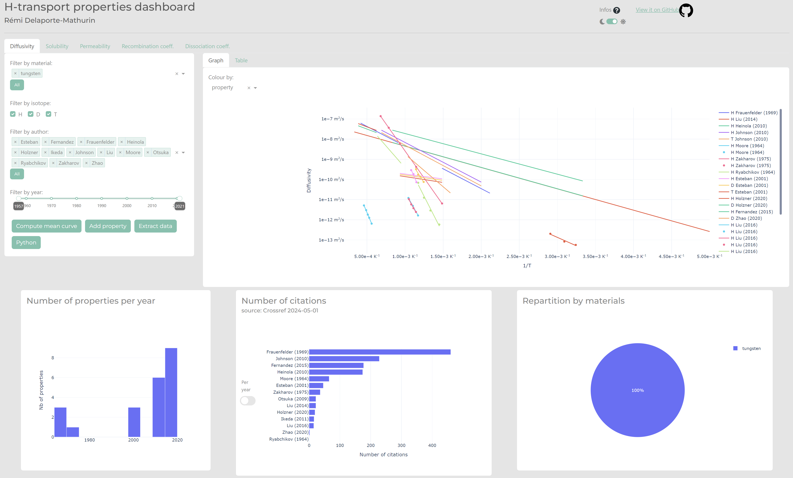
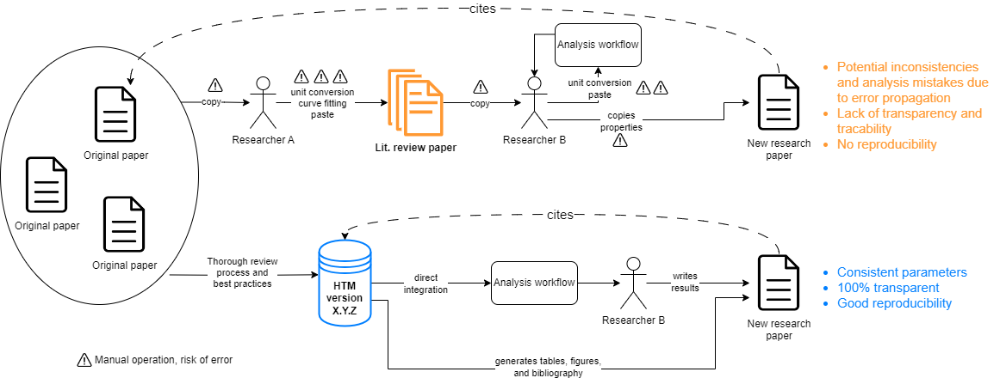

# Summary

`hydrogen_transport_materials` is designed to streamline and automate the analysis of hydrogen transport properties. By integrating a variety of features such as unit conversion with `pint`, data fitting with `scipy`, and comprehensive bibliographic support (`bibtex`), the module simplifies workflows that traditionally involve a variety of manual steps. It provides a robust API for seamless integration into existing research pipelines and allows users to interact with both raw and processed data through a user-friendly online dashboard built using `plotly-dash` (see \autoref{fig:dashboard}). The module supports exporting analysis results in various formats, including JSON and LaTeX, enhancing its utility for generating reports, publications, or further analysis. With an emphasis on open-source development and version control, it promotes community collaboration and continuous improvement, allowing for quick resolution of issues and the release of patch versions when necessary. This tool is highly versatile, designed to support researchers in the field by automating repetitive tasks and ensuring the reproducibility of their analyses.

# Statement of need

Hydrogen transport properties are critical for a wide range of applications, from energy storage and fuel cells [@H-Storage_Schlapbach_2001][@H-Storage_Ren_2017], hydrogen embrittlement studies in materials science 
[@Embrittlement_Oriani_1978][@Embrittlement_Li_2020], to safety studies in nuclear applications [@forsberg2017tritium][@osti_1777267][@abdou2020physics].
Researchers in these fields are highly dependent on accurate and comprehensive data on properties such as diffusivity, solubility, and recombination and dissociation coefficients.
Traditionally, these data have been scattered across numerous research papers, creating significant challenges for those who need to aggregate, standardise and interpret the information.

To address this issue, some researchers have undertaken the task of compiling review papers that aggregate data from various sources.
However, these traditional literature reviews suffer from several critical drawbacks.
Firstly, the manual aggregation process is prone to errors, including copy-paste mistakes, typos, and unit conversion errors.
Additionally, inconsistencies in data fitting and referencing often arise, further complicating the reliability of these reviews.

Another major issue is the lack of transparency in traditional reviews.
The methodologies and sources used are not always clear, making it difficult for other researchers to verify the accuracy of the compiled data. For example, whether a property is given in units of $\mathrm{H}$ atoms or $\mathrm{H}_2$ molecules, various unit conversions with undefined parameters such as temperature or density, or as simple as a paper not including the units of the properties.  
Moreover, once published, these reviews become static documents that do not accommodate new data or corrections, leading to obsolescence.
As new research emerges, the reviews quickly become outdated, and errors that are identified post-publication are rarely, if ever, corrected.

Given these challenges, there is a pressing need for a more reliable, accessible, and up-to-date approach to aggregating hydrogen transport properties.
This paper proposes the HTM database as a modern solution to these problems.
HTM is an online, open-source database designed to provide accurate, transparent, and continuously updated data on hydrogen transport properties.

Unlike traditional literature reviews, HTM offers several key advantages.
It automates unit conversion and data fitting processes, significantly reducing the potential for human error (see \autoref{fig:application_case}).
The database is also designed to be transparent, with all sources and methodologies clearly documented.
Furthermore, HTM is a living database that can be continuously updated with new data, ensuring that researchers always have access to the most current information.
The open-source nature of HTM allows for community contributions and corrections, fostering a collaborative and dynamic research environment.

In this paper, we will discuss the key hydrogen transport properties, describe the features and architecture of the HTM database, outline the workflow for contributing to and maintaining the database, and compare HTM with traditional literature reviews.
We will also explore the future directions for HTM, including potential improvements and applications.

# Acknowledgements

We acknowledge contributions from Nate Gehmlich, Paul Barron, and Christian Hill.

# References
